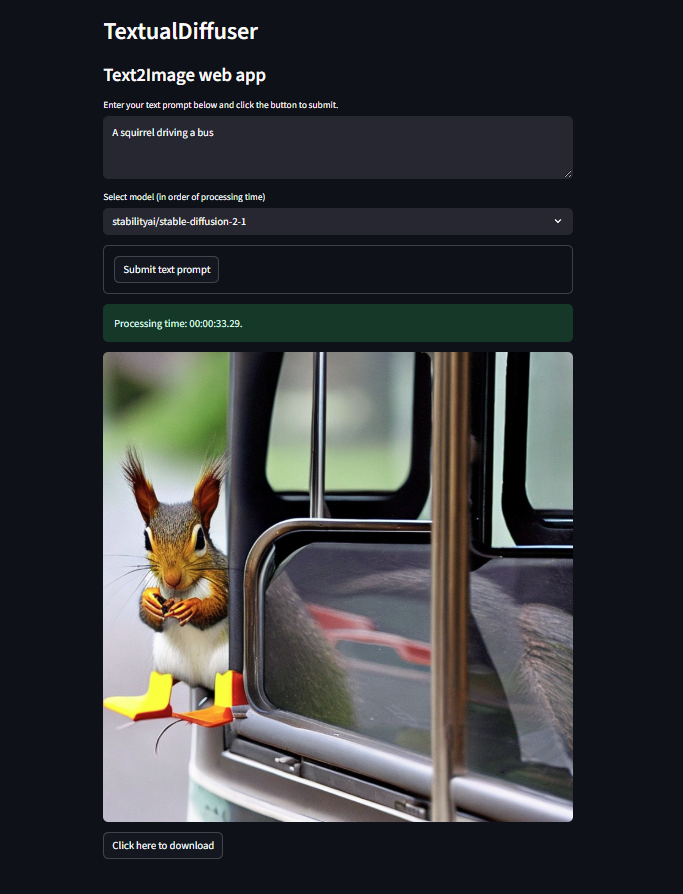

# TextualDiffuser
TextualDiffuser is a text-to-image generation tool powered by Stable Diffusion. It transforms natural language prompts into high-quality visuals, making AI-powered creativity accessible for developers, designers, and artists. It allows users to:

- ✍️ Write a **text prompt**
- 🔧 Choose a **diffusion model**
- 🖼️ **Generate** an image
- 💾 **Download** the result



---

## 🚀 Features

- Interactive text-to-image generation
- Model selection from sidebar
- Live image preview with download option
- Easy-to-use web interface with Streamlit

---

## 🛠️ Installation

### 1. Clone the Repository

```bash
git clone https://github.com/edcalderin/TextualDiffuser.git
cd TextualDiffuser
```

### 2. (Optional) Create and Activate Virtual Environment

```bash
conda create -n textual_diffuser python=3.12
conda activate textual_diffuser
```
```bash
source activate textual_diffuser      # On Windows
```

### 3. Install Requirements
```bash
pip install -r requirements.txt
```

## ▶️ Run the App
```bash
python -m streamlit run src/streamlit.py
```

## ✨ Usage

1. Enter a text prompt (e.g., "a fantasy landscape with dragons").
2. Select a diffusion model from the sidebar.
3. Click Generate Image.
4. Preview the result and click Download if you want to save it.

## Lint
```bash
ruff format .
ruff check . --fix
```

## Removing the environment
```bash
conda env remove -n textual_diffuser
```

## ✉️ Contact
LinkedIn: https://www.linkedin.com/in/erick-calderin-5bb6963b/  
e-mail: edcm.erick@gmail.com